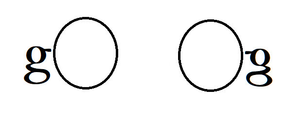

# what is this resp
    its about exercise of golang, make sone node for that.
 
 
  

# GolangTraining
Fork from GolangTraining
Training and exercise for Golang (go language)

# format
    go code case and example

# context
    golang language base funcation and expand 